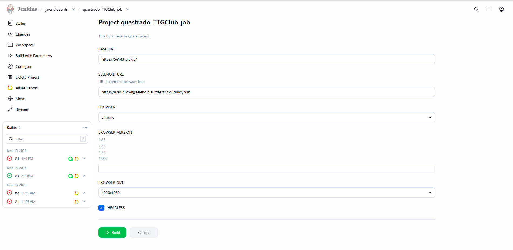
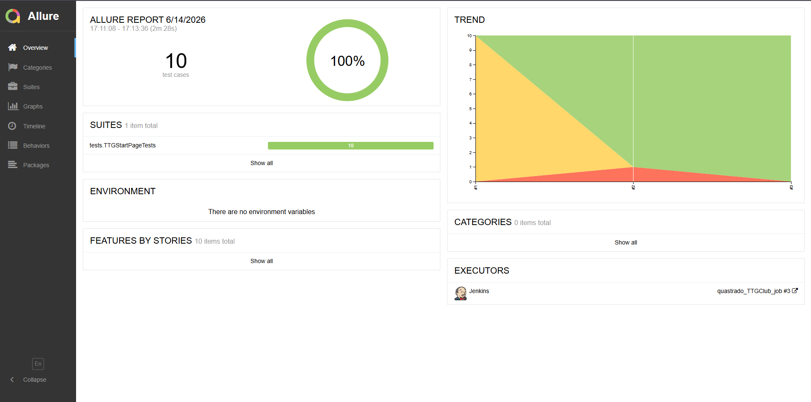
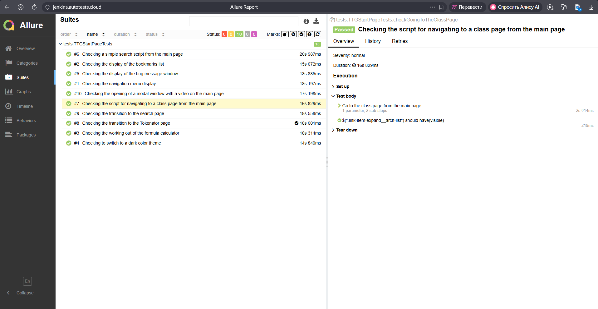
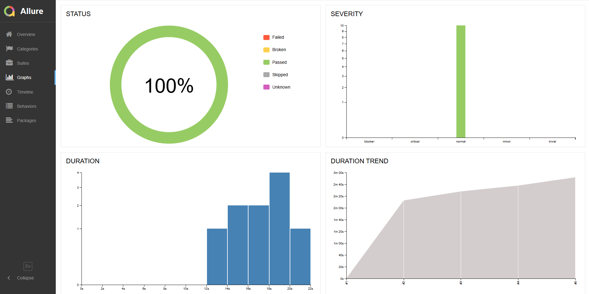
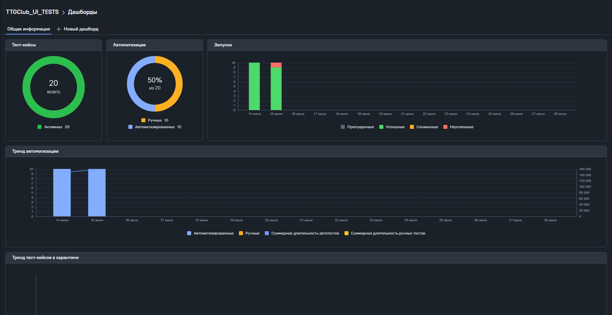
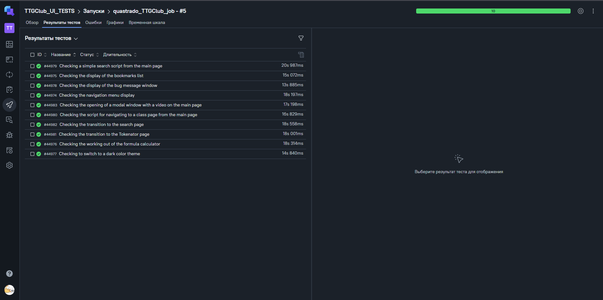
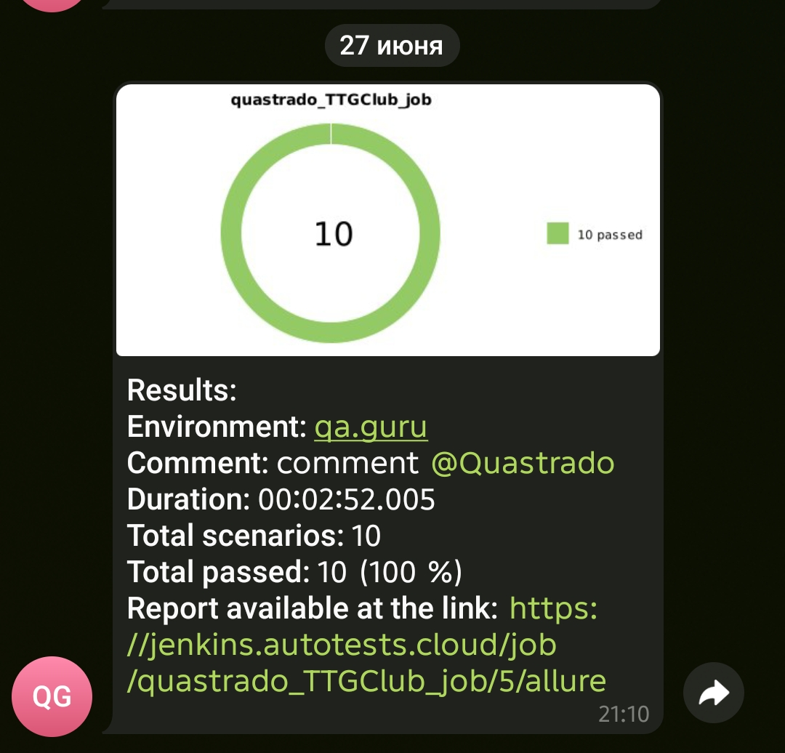

# Проект по автоматизации тестирования UI части стартовой страницы онлайн справочника D&D TTG Club

  > Тестируемый ресурс - https://5e14.ttg.club/

## Стек технологий

<p align="center">
<a href="https://www.java.com/"></a>
<a href="https://www.jetbrains.com/idea/"></a>
<a href="https://junit.org/junit5/"></a>
<a href="https://qameta.io/allure-report/"></a>
<a href="https://www.jenkins.io/"></a>
<a href="https://www.atlassian.com/software/jira"></a>
<a href="https://telegram.org/"></a>
</p>

## Список проверок

- Проверка простого сценария поиска с главной страницы
- Проверка отображения навигационного меню
- Проверка перехода на страницу поиска
- Проверка отображения списка закладок
- Проверка отображения окна для сообщения о баге
- Проверка переключения на тёмную цветовую тему
- Проверка сценария перехода на страницу класса с главной страницы
- Проверка открытия модального окна с видеороликом на главной странице
- Проверка отработки калькулятора формул
- Проверка перехода на страницу с Токенатором

## Запуск тестов
### Из терминала
```bash
clean test \
-DbaseUrl=$BASE_URL \
-DremoteBrowserUrl=$SELENOID_URL \
-Dbrowser=$BROWSER\
-DbrowserVersion=$BROWSER_VERSION \
-Dheadless=$HEADLESS \
-DbrowserSize=$BROWSER_SIZE
```
Используемые параметры:
- BASE_URL (url адрес тестируемой страницы);
- SELENOID_URL (url адрес удалённой фермы браузеров);
- BROWSER (браузер);
- BROWSER_VERSION (версия браузера);
- HEADLESS (параметр для запуска UI тестов без открытия браузера);
- BROWSER_SIZE (параметр расширения браузера)

 ### Из Jemkins
<p align="center">

</p>

- Выбрать браузер;
- Выбрать разрешение браузера;
- Запустить сборку

## Allure Report
### Дашборд
<p align="center">

</p>

### Пройденные тесты
<p align="center">

</p>

### Метрики
<p align="center">

</p>

## Allure TestOps
### Дашборд
<p align="center">

</p>

### Автоматизированные и ручные тест-кейсы
<p align="center">

</p>

## Telegram уведомления
<p align="center">

</p>
